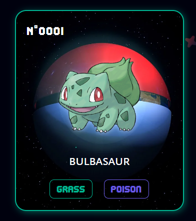
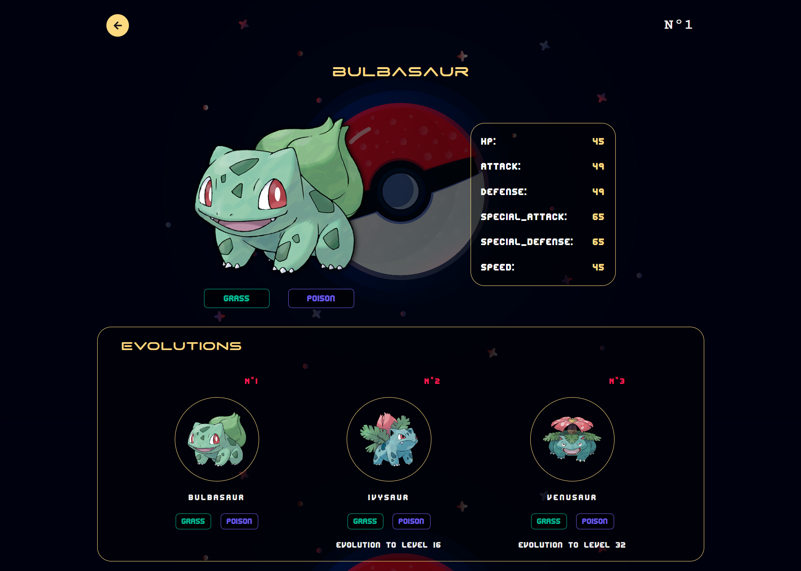

# Pokedex

The pokedex is a device from the video game or animated series that allows you to view the statistics of the different pokemon.

## ⚙️ Function of the website

- The search engine allows you to find a pokemon by its name or number.

- The pokémon type filter allows you to display only pokémon of the selected type.

- The pokemon card allows you to view certain pokemon information.

  

  When you click on the pokemon card, another page will appear where you will be able to see its statistics and evolutions.

    

## 🚀 Technologies and tools used

- [ReactJS](https://es.react.dev/).
- [Vite](https://vitejs.dev/).
- [sass](https://sass-lang.com/).
- [React-icons](https://www.npmjs.com/package/react-icons).
- Api [PokeAPI](https://pokeapi.co/).

## 📊 Project status

✅ Completed

## 🌐 [Website](https://bryangrandon.github.io/Pokedex/)

